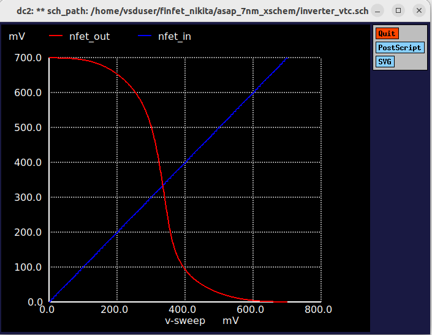
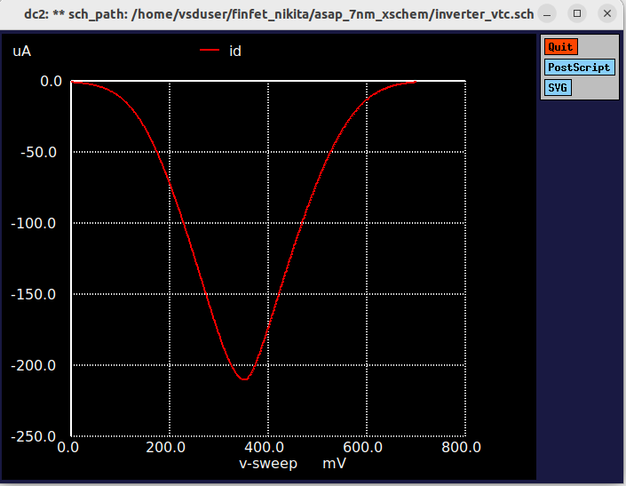
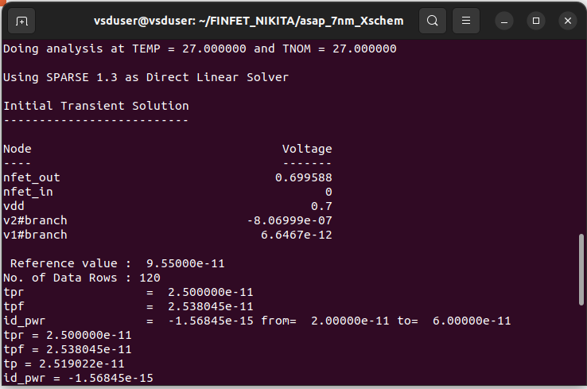
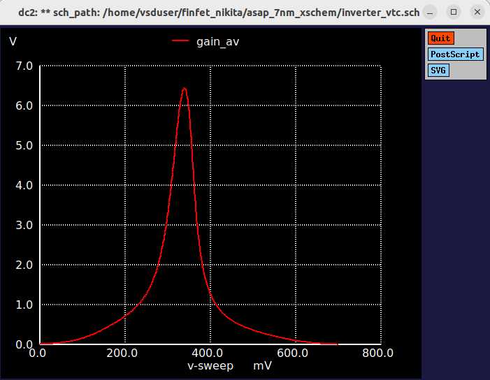
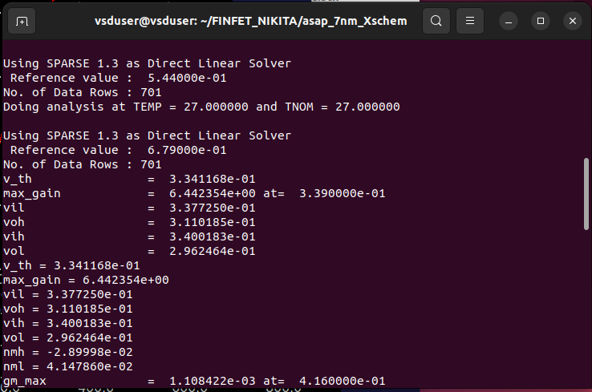
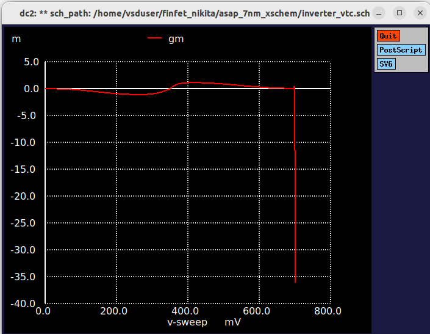
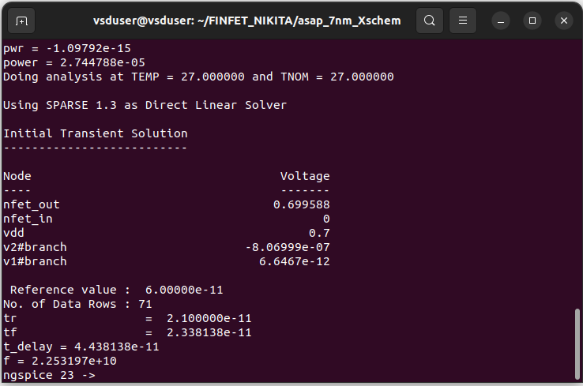
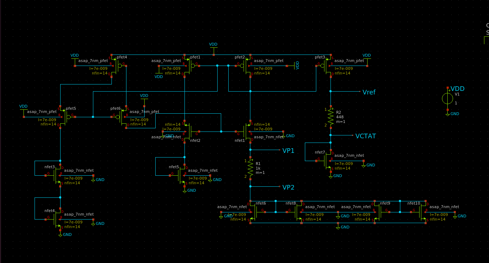

# 7nm-FINFET-Circuit-Simulation
# FinFET-Based Inverter and Bandgap Reference Analysis using ngspice

## Overview
This project explores FinFET device behavior and circuit-level performance
using ngspice simulations. The work begins with a theoretical study of device
scaling and FinFET motivation, followed by practical analysis of a FinFET-based
inverter and a bandgap reference circuit.

An open-source FinFET SPICE deck was used as the base and modified to study
various electrical and performance parameters.

---

## Background Study
- Zeta scaling and limitations of CMOS planar devices
- Motivation for FinFET technology at advanced nodes
- Basic FinFET structure and layout concepts
- Comparison between planar CMOS and FinFET devices

---

## Tools & Technology
- ngspice
- xschem
- Open-source FinFET SPICE models

---

## FinFET Inverter Analysis

### Methodology
- Used a FinFET inverter SPICE deck
- Modified **channel width (W)** and **channel length (L)** of:
  - n-FinFET, having Nfin = 14
  - p-FinFET, having Pfin = 12
- Performed DC and AC simulations to evaluate inverter behavior

### FINFET based Inverter spice deck
```
**.subckt inverter_vtc
Xpfet1 nfet_out nfet_in vdd vdd asap_7nm_pfet l=7e-009 nfin=12
Xnfet1 nfet_out nfet_in GND GND asap_7nm_nfet l=7e-009 nfin=14
V1 nfet_in GND pulse(0 0.7 20p 10p 10p 20p 500p 1)
V2 vdd GND 0.7
```

### Parameters Analyzed
- Voltage Transfer Characteristics (VTC)
```
meas dc v_th when nfet_out = nfet_in
plot nfet_out nfet_in
```
  

- Drain current (Id)
```
plot id
```
 

- Power consumption
```
meas tran id_pwr integ trans_current from=2e-11 to=6e-11
let pwr = id_pwr * 0.7
let power = abs(pwr / 40e-12)
```
- Propagation delay
```
meas tran tpr when nfet_in = 0.35 rise = 1
meas tran tpf when nfet_out = 0.35 fall = 1
let tp = (tpr + tpf) / 2
```
 

- Gain
```
let gm = real(deriv(id, nfet_in))
```


- Noise margin
```
 meas dc vil find nfet_in when gain_av = gain_target cross=1
 meas dc voh find nfet_out when gain_av = gain_target cross=1
 meas dc vih find nfet_in when gain_av = gain_target cross=2
 meas dc vol find nfet_out when gain_av = gain_target cross=2
 let nmh = voh - vih
 let nml = vil - vol
```


- Transconductance (gm)
```
let gain_av = abs(deriv(nfet_out))
```

- Frequency response
```
meas tran tr when nfet_in=0.07 RISE=1  
meas tran tf when nfet_out=0.63 FALL=1 
let t_delay = tr + tf                  
print t_delay                         
let f = 1/t_delay
```


### Key Observations
- Improved gain and noise margins compared to planar CMOS
- Reduced short-channel effects
- Better switching characteristics due to FinFET electrostatic control

### Results

---

## Bandgap Reference Circuit

### Circuit Description
A FinFET-based bandgap reference circuit was implemented using a provided
circuit topology. To introduce a unique design variation, the resistor value
in the biasing network was modified.


### Unique Design Choice
- Bias resistor value set to **448 Ω**
- Value derived from the **ASCII representation** to ensure design uniqueness


---
### Spice Deck for Bandgap Reference circuit
```
** sch_path:  /home/vsduser/FINFET_NIKITA/asap_7nm_Xschem/BGR_nsm.sch
**.subckt bandgap_ref
Xnfet1 net3 net1 net7 net10 asap_7nm_nfet l=7e-009 nfin=14
Xnfet2 net2 net1 net9 net11 asap_7nm_nfet l=7e-009 nfin=14
Xpfet1 net3 net2 VDD net12 asap_7nm_pfet l=7e-009 nfin=14
Xpfet2 net2 net2 VDD net13 asap_7nm_pfet l=7e-009 nfin=14
Xpfet3 Vref net2 VDD net14 asap_7nm_pfet l=7e-009 nfin=14
Xpfet4 net4 net2 VDD net15 asap_7nm_pfet l=7e-009 nfin=14
Xpfet5 net5 net2 net4 net16 asap_7nm_pfet l=7e-009 nfin=14
Xpfet6 net1 net2 net2 net17 asap_7nm_pfet l=7e-009 nfin=14
Xnfet3 net5 net5 net6 net18 asap_7nm_nfet l=7e-009 nfin=14
Xnfet4 net6 net6 GND net19 asap_7nm_nfet l=7e-009 nfin=14
Xnfet5 net7 net7 GND net20 asap_7nm_nfet l=7e-009 nfin=14
Xnfet6 net8 net8 GND GND asap_7nm_nfet l=7e-009 nfin=14
Xnfet7 net8 net8 GND GND asap_7nm_nfet l=7e-009 nfin=14
Xnfet8 net8 net8 GND GND asap_7nm_nfet l=7e-009 nfin=14
Xnfet9 net8 net8 GND GND asap_7nm_nfet l=7e-009 nfin=14
R1 net9 net8 33k ac=1k m=1
R2 Vref Vctat 448 ac=1k m=1
Xnfet10 Vctat Vctat GND net21 asap_7nm_nfet l=7e-009 nfin=14
V1 vdd GND DC 1
**** begin user architecture code
 Modify for DC/Transient
**** end user architecture code
**.ends
.GLOBAL GND
.GLOBAL VDD
**** begin user architecture code

.subckt asap_7nm_pfet S G D B l=7e-009 nfin=14
	npmos_finfet S G D B BSIMCMG_osdi_P l=7e-009 nfin=14
.ends asap_7nm_pfet

.model BSIMCMG_osdi_P BSIMCMG_va (
+ TYPE = 0

************************************************************
*                         general                          *
************************************************************
+version = 107             bulkmod = 1               igcmod  = 1               igbmod  = 0
+gidlmod = 1               iimod   = 0               geomod  = 1               rdsmod  = 0
+rgatemod= 0               rgeomod = 0               shmod   = 0               nqsmod  = 0
+coremod = 0               cgeomod = 0               capmod  = 0               tnom    = 25
+eot     = 1e-009          eotbox  = 1.4e-007        eotacc  = 3e-010          tfin    = 6.5e-009
+toxp    = 2.1e-009        nbody   = 1e+022          phig    = 4.9278          epsrox  = 3.9
+epsrsub = 11.9            easub   = 4.05            ni0sub  = 1.1e+016        bg0sub  = 1.17
+nc0sub  = 2.86e+025       nsd     = 2e+026          ngate   = 0               nseg    = 5
+l       = 2.1e-008        xl      = 1e-009          lint    = -2.5e-009       dlc     = 0
+dlbin   = 0               hfin    = 3.2e-008        deltaw  = 0               deltawcv= 0
+sdterm  = 0               epsrsp  = 3.9             nfin    = 1
+toxg    = 1.8e-009
************************************************************
*                            dc                            *
************************************************************
+cit     = 0               cdsc    = 0.003469        cdscd   = 0.001486        dvt0    = 0.05
+dvt1    = 0.36            phin    = 0.05            eta0    = 0.094           dsub    = 0.24
+k1rsce  = 0               lpe0    = 0               dvtshift= 0               qmfactor= 0
+etaqm   = 0.54            qm0     = 2.183e-012      pqm     = 0.66            u0      = 0.0237
+etamob  = 4               up      = 0               ua      = 1.133           eu      = 0.05
+ud      = 0.0105          ucs     = 0.2672          rdswmin = 0               rdsw    = 200
+wr      = 1               rswmin  = 0               rdwmin  = 0               rshs    = 0
+rshd    = 0               vsat    = 60000           deltavsat= 0.17            ksativ  = 1.592
+mexp    = 2.491           ptwg    = 25              pclm    = 0.01            pclmg   = 1
+pdibl1  = 800             pdibl2  = 0.005704        drout   = 4.97            pvag    = 200
+fpitch  = 2.7e-008        rth0    = 0.15            cth0    = 1.243e-006      wth0    = 2.6e-007
+lcdscd  = 0               lcdscdr = 0               lrdsw   = 1.3             lvsat   = 1441
************************************************************
*                         leakage                          *
************************************************************
+aigc    = 0.007           bigc    = 0.0015          cigc    = 1               dlcigs  = 5e-009
+dlcigd  = 5e-009          aigs    = 0.006           aigd    = 0.006           bigs    = 0.001944
+bigd    = 0.001944        cigs    = 1               cigd    = 1               poxedge = 1.152
+agidl   = 2e-012          agisl   = 2e-012          bgidl   = 1.5e+008        bgisl   = 1.5e+008
+egidl   = 1.142           egisl   = 1.142
************************************************************
*                            rf                            *
************************************************************
************************************************************
*                         junction                         *
************************************************************
************************************************************
*                       capacitance                        *
************************************************************
+cfs     = 0               cfd     = 0               cgso    = 1.6e-010        cgdo    = 1.6e-010
+cgsl    = 0               cgdl    = 0               ckappas = 0.6             ckappad = 0.6
+cgbo    = 0               cgbl    = 0
************************************************************
*                       temperature                        *
************************************************************
+tbgasub = 0.000473        tbgbsub = 636             kt1     = 0               kt1l    = 0
+ute     = -1.2            utl     = 0               ua1     = 0.001032        ud1     = 0
+ucste   = -0.004775       at      = 0.001           ptwgt   = 0.004           tmexp   = 0
+prt     = 0               tgidl   = -0.007          igt     = 2.5
************************************************************
*                          noise                           *
************************************************************
**)
.control
pre_osdi /home/vsduser/FINFET_NIKITA/asap_7nm_Xschem/bsimcmg.osdi
.endc


.subckt asap_7nm_nfet S G D B l=7e-009 nfin=14
	nnmos_finfet S G D B BSIMCMG_osdi_N l=7e-009 nfin=14
.ends asap_7nm_nfet

.model BSIMCMG_osdi_N BSIMCMG_va (
+ TYPE = 1
************************************************************
*                         general                          *
************************************************************
+version = 107             bulkmod = 1               igcmod  = 1               igbmod  = 0
+gidlmod = 1               iimod   = 0               geomod  = 1               rdsmod  = 0
+rgatemod= 0               rgeomod = 0               shmod   = 0               nqsmod  = 0
+coremod = 0               cgeomod = 0               capmod  = 0               tnom    = 25
+eot     = 1e-009          eotbox  = 1.4e-007        eotacc  = 1e-010          tfin    = 6.5e-009
+toxp    = 2.1e-009        nbody   = 1e+022          phig    = 4.2466          epsrox  = 3.9
+epsrsub = 11.9            easub   = 4.05            ni0sub  = 1.1e+016        bg0sub  = 1.17
+nc0sub  = 2.86e+025       nsd     = 2e+026          ngate   = 0               nseg    = 5
+l       = 2.1e-008        xl      = 1e-009          lint    = -2e-009         dlc     = 0
+dlbin   = 0               hfin    = 3.2e-008        deltaw  = 0               deltawcv= 0
+sdterm  = 0               epsrsp  = 3.9             nfin    = 1
+toxg    = 1.80e-009
************************************************************
*                            dc                            *
************************************************************
+cit     = 0               cdsc    = 0.01            cdscd   = 0.01            dvt0    = 0.05
+dvt1    = 0.47            phin    = 0.05            eta0    = 0.07            dsub    = 0.35
+k1rsce  = 0               lpe0    = 0               dvtshift= 0               qmfactor= 2.5
+etaqm   = 0.54            qm0     = 0.001           pqm     = 0.66            u0      = 0.0303
+etamob  = 2               up      = 0               ua      = 0.55            eu      = 1.2
+ud      = 0               ucs     = 1               rdswmin = 0               rdsw    = 200
+wr      = 1               rswmin  = 0               rdwmin  = 0               rshs    = 0
+rshd    = 0               vsat    = 70000           deltavsat= 0.2             ksativ  = 2
+mexp    = 4               ptwg    = 30              pclm    = 0.05            pclmg   = 0
+pdibl1  = 0               pdibl2  = 0.002           drout   = 1               pvag    = 0
+fpitch  = 2.7e-008        rth0    = 0.225           cth0    = 1.243e-006      wth0    = 2.6e-007
+lcdscd  = 5e-005          lcdscdr = 5e-005          lrdsw   = 0.2             lvsat   = 0
************************************************************
*                         leakage                          *
************************************************************
+aigc    = 0.014           bigc    = 0.005           cigc    = 0.25            dlcigs  = 1e-009
+dlcigd  = 1e-009          aigs    = 0.0115          aigd    = 0.0115          bigs    = 0.00332
+bigd    = 0.00332         cigs    = 0.35            cigd    = 0.35            poxedge = 1.1
+agidl   = 1e-012          agisl   = 1e-012          bgidl   = 10000000        bgisl   = 10000000
+egidl   = 0.35            egisl   = 0.35
************************************************************
*                            rf                            *
************************************************************
************************************************************
*                         junction                         *
************************************************************
************************************************************
*                       capacitance                        *
************************************************************
+cfs     = 0               cfd     = 0               cgso    = 1.6e-010        cgdo    = 1.6e-010
+cgsl    = 0               cgdl    = 0               ckappas = 0.6             ckappad = 0.6
+cgbo    = 0               cgbl    = 0
************************************************************
*                       temperature                        *
************************************************************
+tbgasub = 0.000473        tbgbsub = 636             kt1     = 0               kt1l    = 0
+ute     = -0.7            utl     = 0               ua1     = 0.001032        ud1     = 0
+ucste   = -0.004775       at      = 0.001           ptwgt   = 0.004           tmexp   = 0
+prt     = 0               tgidl   = -0.007          igt     = 2.5
************************************************************
*                          noise                           *
************************************************************
**)
.control
pre_osdi /home/vsduser/FINFET_NIKITA/asap_7nm_Xschem/bsimcmg.osdi
.endc


**** end user architecture code
.end

```

### DC Analysis
- Performed DC sweep to observe reference voltage (Vref)
- Studied variation of output voltage with:
  - Supply voltage (VDD)
  - Temperature

### Transient Analysis
- Startup behavior of the bandgap reference was analyzed
- Startup time and stability were observed using transient simulations

### Performance Metrics Recorded
- Reference voltage stability
- Line regulation (VDD variation)
- Temperature dependence
- Startup behavior

---
## Credits
This work is based on an open-source FinFET SPICE model and inverter deck
sourced from GitHub.

Full credit is given to the original contributors:
-ahdvakd
-ygfagj
